# BEAMS App

BEAMS App — Android-приложение для локального управления аквариумными
светильниками BEAMS.

> Это независимый неофициальный проект, не связанный с производителем
> светильников BEAMS. BEAMS и связанные наименования могут являться
> товарными знаками соответствующих владельцев.

[English version](README_EN.md)

[Журнал изменений](CHANGELOG.md)

## Статус тестирования и ответственность

Приложение находится в стадии тестирования. Его работа подтверждена со
светильниками моделей **BEAMS F-4 v2.0**, **BEAMS F-6 v2.0**,
**BEAMS 2 PRO R-8**, **BEAMS 2 MAX R-10**, **BEAMS 2 PRO F-6**,
**BEAMS 2 MAX F-8** и **BEAMS MAX F-8**.

Перед тестированием крайне рекомендуется локально сохранить из светильника все
сохранённые спектры и циклы, чтобы избежать их возможной утраты.

Автор не несёт ответственности за возможную утрату сохранённых настроек,
спектров или циклов, а также за возможные повреждения аппаратной части
светильников. Вы используете приложение на свой страх и риск.

## Отчёт для диагностики

Отчёт для диагностики — основной способ передать разработчику сведения о
проблеме со светильником. Чтобы его создать:

1. Подключите приложение к светильнику.
2. Откройте настройки по значку шестерёнки в верхней части экрана.
3. Внизу раздела «Приложение» нажмите «Создать отчёт для диагностики».
4. При необходимости укажите PPFD@25 и DLI, показанные во встроенном
   веб-интерфейсе светильника. Поля необязательны: оставьте их пустыми, если
   показатели не отображаются или не были зафиксированы.
5. Нажмите «Создать отчёт» и в системном окне Android сохраните или отправьте
   созданный JSON-файл вместе с описанием проблемы и моделью Android-устройства.
6. Желательно отправлять два отчёта с разными уровнями каналов — например,
   в автоматическом и ручном режимах.

Отчёт не содержит IP-адрес или имя хоста светильника. В нём сохраняются
диагностические данные, техническая информация и данные встроенного
веб-интерфейса, необходимые для разбора проблемы.

Если приложению не удалось подключиться к светильнику и создать отчёт,
скопируйте техническую информацию во встроенном веб-интерфейсе светильника:
нажмите надпись TrueSpectrum внизу страницы и приложите информацию к описанию
проблемы.

## Скриншоты

  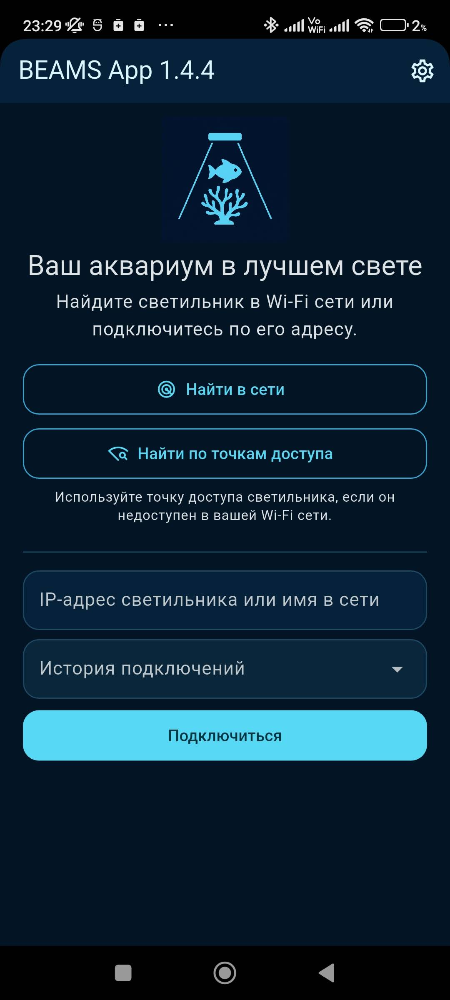
  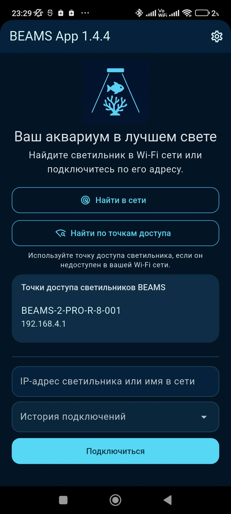
  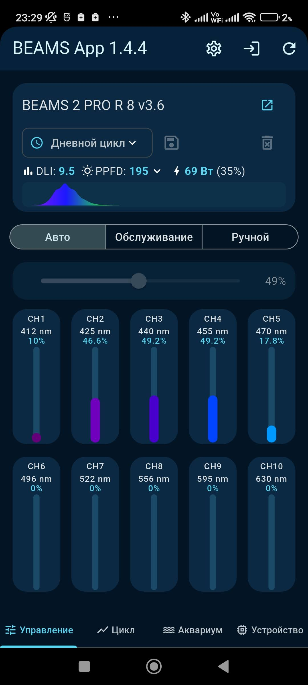

  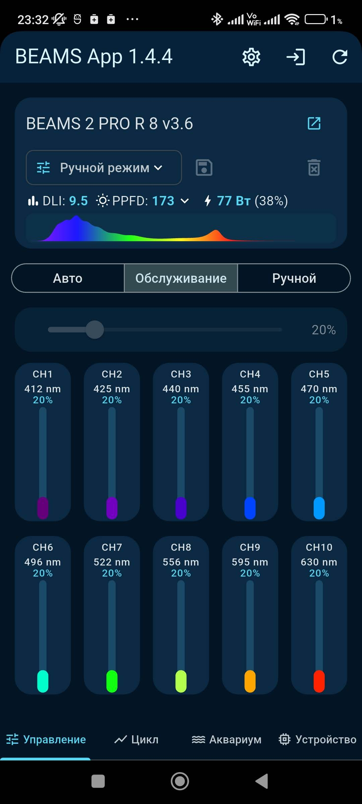
  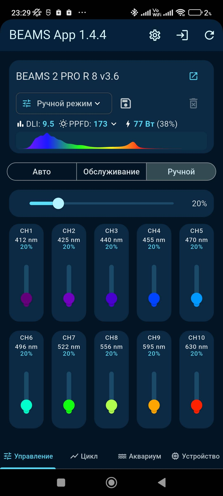
  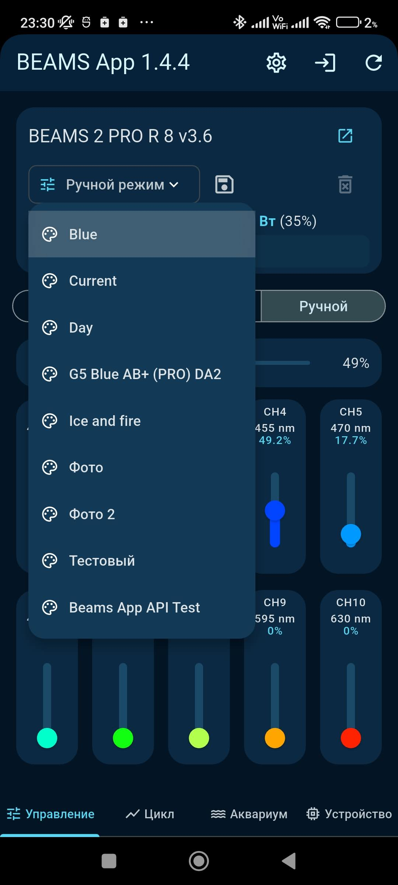

  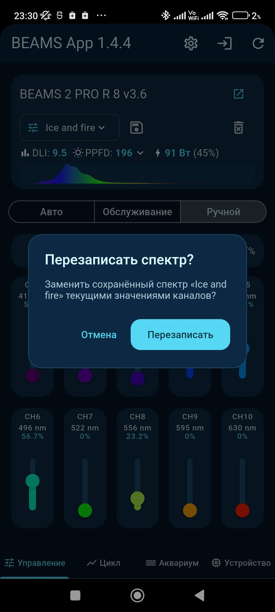
  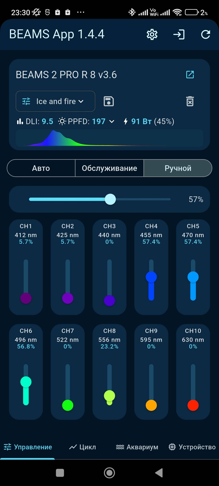
  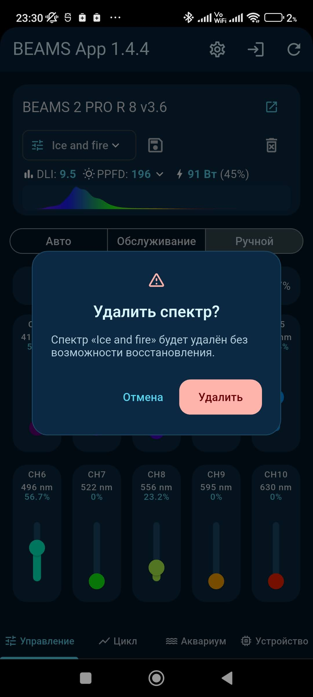

  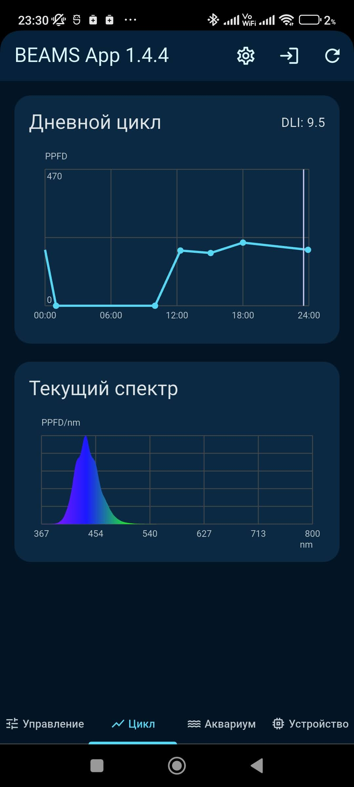
  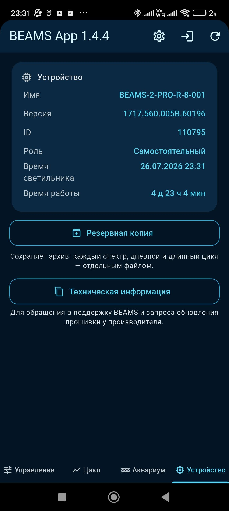
  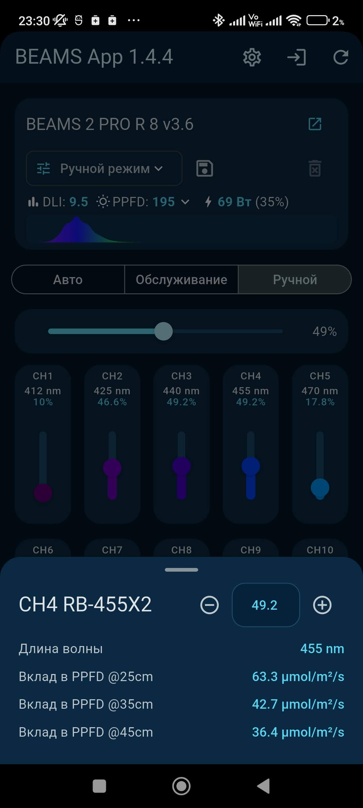

  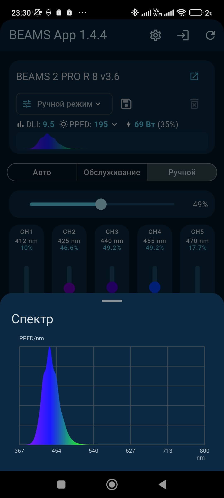
  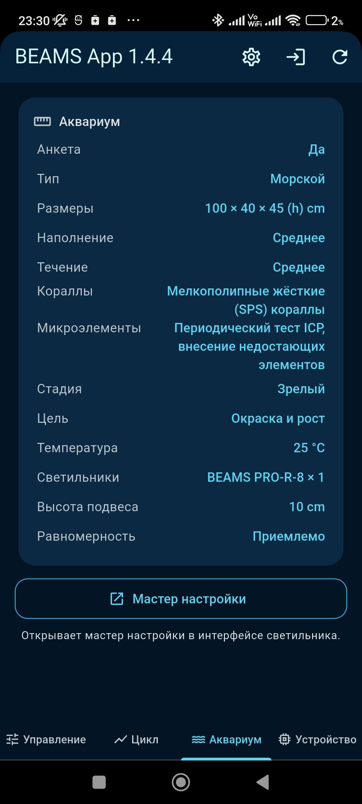
  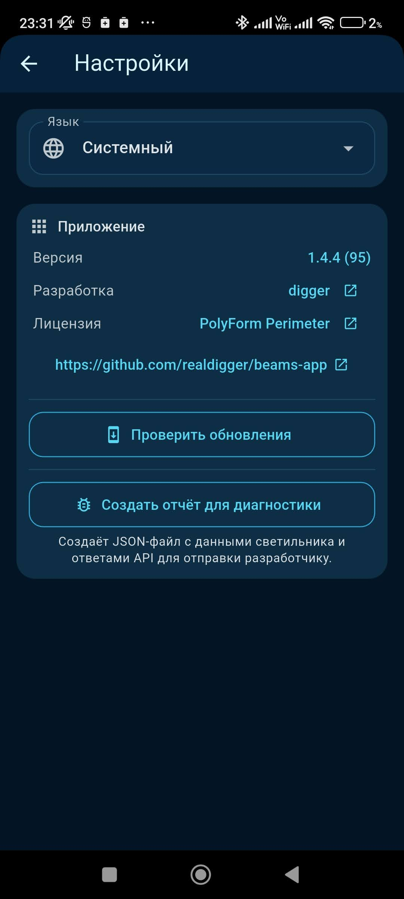

  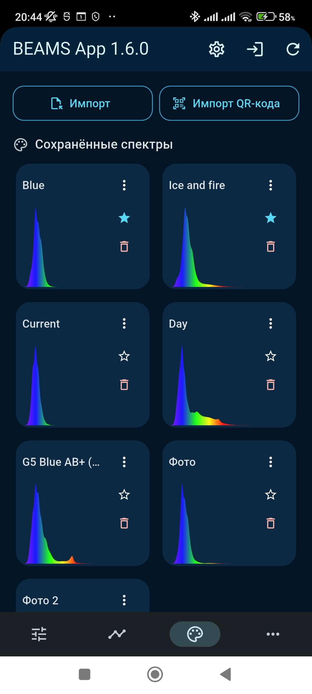
  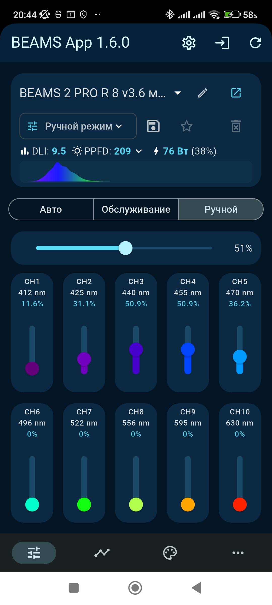

  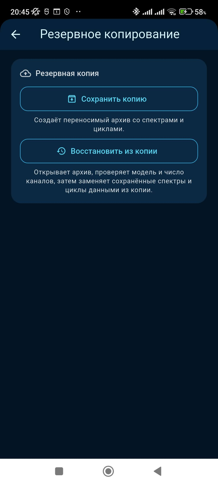
  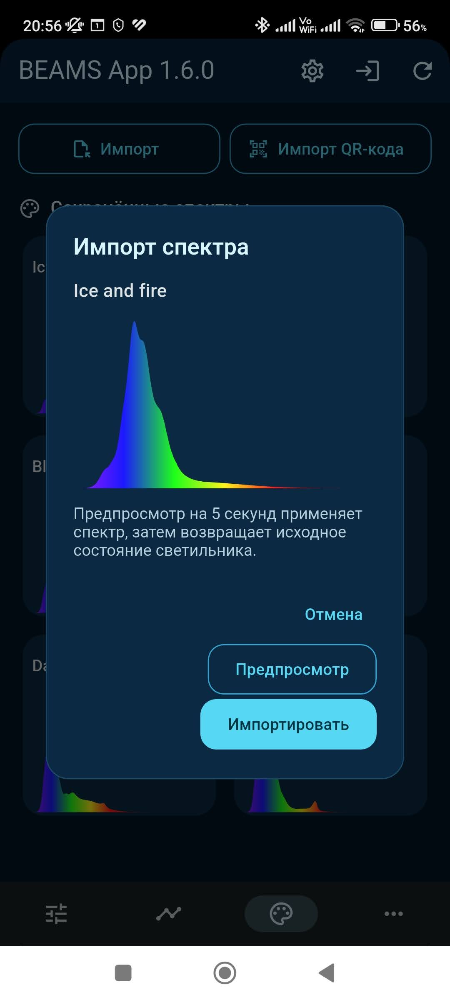
  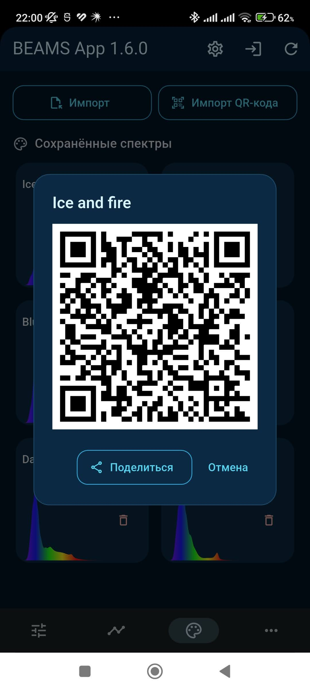

## Возможности

- Поиск совместимых светильников через mDNS и, при необходимости, сканирование
  локального IPv4-диапазона Wi-Fi с отображением хода поиска.
- Поиск и прямое подключение к Wi‑Fi точкам доступа светильников BEAMS. Это
  дополнительный способ подключения, когда светильник не находится в основной
  Wi-Fi сети. Для поиска точек доступа Android требуется разрешение на доступ
  к местоположению.
- Прямое подключение по IP-адресу, имени хоста или полному URL светильника с
  запоминанием до десяти последних успешных подключений. Для светильника можно
  задать собственное имя; оно привязано к модели и ID контроллера и сохраняется
  при смене IP-адреса.
- Автоматическое восстановление последнего подключения при запуске.
- Приостановка автоматического опроса, когда приложение неактивно или
  недоступен Wi‑Fi, и полное обновление данных после возвращения приложения
  или Wi‑Fi.
- Открытие встроенного веб-интерфейса светильника по специальной иконке
  перехода.
- Поддержка русского и английского языков: по умолчанию используется язык
  системы, а выбранный вручную язык сохраняется в приложении.
- Проверка доступности новой версии через GitHub Releases вручную, а также
  автоматически — не чаще одного раза в 24 часа — с переходом на страницу
  релиза. Найденная версия сохраняется и отображается в настройках до
  обновления приложения или успешной проверки без новой версии.
- Отображение модели светильника, роли контроллера, сведений об
  аппаратном и программном обеспечении, диагностики, времени контроллера и
  времени его работы, а также технической информации, копируемой для
  обращения в поддержку производителя.
- Отображение параметров аквариума из анкеты светильника: заполненности,
  размеров, типа, количества светильников и плотности размещения.
- Создание JSON-отчёта для диагностики: в нём сохраняются показания
  приложения, краткая техническая информация, ответы известных API, HTML и
  JavaScript встроенного веб-интерфейса светильника. При необходимости в отчёт
  можно вручную добавить отображаемые веб-интерфейсом значения PPFD@25 и DLI.
  IP-адрес и имя хоста в отчёт не включаются.
- Создание переносимой резервной копии всех спектров, дневных и длинных циклов
  светильника, кроме встроенных защищённых циклов. Перед восстановлением
  приложение показывает источник архива, дату, состав и количество каналов;
  сообщает о копии с этого же светильника и блокирует импорт при несовпадении
  числа каналов. До удаления данных создаётся защитная копия текущих настроек
  в `Downloads/BEAMS App`. Манифест архива содержит модель и ID контроллера,
  конфигурацию каналов и техническую спецификацию. Восстанавливаются все три
  типа объектов. У кнопок сохранения и восстановления отображаются отдельные
  пояснения о выполняемом действии.
- Отображение текущего графика дневного цикла, DLI, PPFD на высоте 25, 35 и
  45 см, а также мощности. Расчёт PPFD и вклада каналов учитывает размеры
  аквариума и конфигурацию светильников из анкеты контроллера.
- График текущего спектра, рассчитанный по спектральным данным LED, их
  количеству в каналах и текущим уровням каналов.
- Переключение между автоматическим, ручным режимами и режимом обслуживания,
  в котором все каналы устанавливаются на 20%.
- Управление отдельными LED-каналами и общей яркостью в ручном режиме. Как и
  во встроенном веб-интерфейсе, общая яркость равна максимальному текущему
  значению канала, а её изменение пропорционально масштабирует все каналы.
- Адаптивная раскладка ползунков для светильников с 6–14 каналами: все каналы
  отображаются максимум в двух рядах.
- Отображение длины волны и цвета каждого канала. Карточка канала показывает
  полное название, длину волны, уровень и вклад в PPFD на всех трёх высотах;
  в ручном режиме уровень можно задать с точностью до сотых процента.
- Просмотр сохранённых спектров в компактной сетке с графиками. Касание
  графика запрашивает подтверждение и применяет спектр; избранное и удаление
  доступны на карточке, экспорт в файл и QR-код — в её меню. Также можно
  сохранить текущие ручные значения каналов как новый спектр или перезаписать
  выбранный.

## Требования

- Android 5.0 (API 21) или новее.

## Локальная работа

Приложение напрямую взаимодействует со светильником по REST API в локальной
сети. Для работы не требуются облачная учётная запись или внешние
сервисы. Встроенный веб-интерфейс светильника при необходимости открывается
в браузере устройства. Только проверка обновлений обращается к GitHub Releases.

## Лицензия

Проект распространяется по
[PolyForm Perimeter License 1.0.1](LICENSE).
